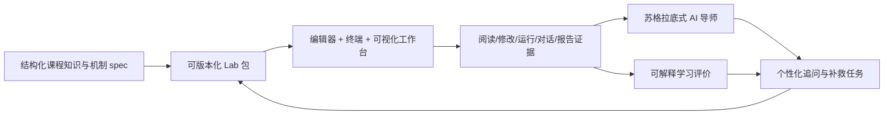
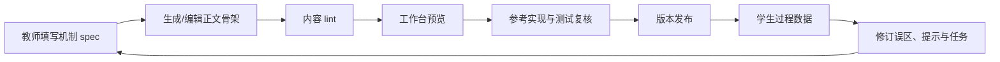
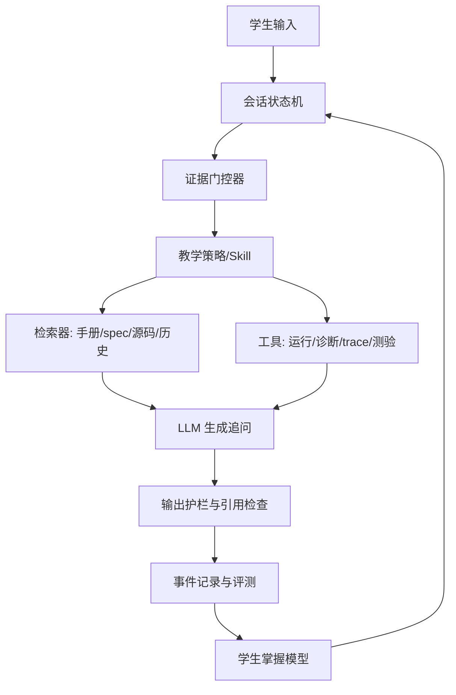

# 操作系统实验平台后续发展与三人实施计划

## 一、结论先行

三个设想都可行，但不能作为三条互不相干的功能线同时推进。最合理的主线是：




换句话说：文档不只是静态内容，编辑器也不只是界面，AI 导师也不只是聊天框。三者应共享同一个“Lab 教学规格”，并围绕学生产生的真实证据协同工作。

### 1. 可行性判断


| 方向                | 可行性 | 当前基础                                            | 主要难点                                      | 建议定位                                               |
| ----------------- | --- | ----------------------------------------------- | ----------------------------------------- | -------------------------------------------------- |
| 完善静态文档与知识层次       | 高   | 已有 Lab1-8、统一章节、总览知识图                            | 内容关系主要写在人读的 Markdown 中，机器难以复用             | 第一优先，先建轻量教学 spec，不急着上图数据库                          |
| VS Code 式代码/终端一体化 | 高   | 已有文件树、可编辑文本框、保存接口、命令运行与 SSE 输出                  | 当前不是专业编辑器、终端不可交互、运行并发与验证可信度不足             | 第二优先，采用 Monaco + xterm.js 的“教学工作台”，不直接嵌入完整 VS Code |
| 真实运行状态可视化         | 中高  | 内核可修改、QEMU 输出可获取、已有 Mermaid 静态图                 | 必须先定义结构化 trace，不能只做演示动画                   | 先做 2D 时间线/状态图；3D 仅用于页表等确有空间层次的场景                   |
| AI 导师稳定运行与苏格拉底式引导 | 高   | 三层提示词、五阶段流程、SSE、离线降级、护栏均已存在                     | 仅靠 prompt/关键词不可靠，缺少证据门控、长期学生模型和评测 harness | 把导师升级为“状态机 + 工具 + 证据门控”，Skill 只承载策略，不承担全部控制        |
| 学习过程记录与可信评分       | 中高  | 事件 v1、JSONL、本地记录、启发式评分、报告与账号已存在                 | 数据未完全挂接账号；退出码 0 不等于 Lab 真通过；当前评分容易刷       | 先建可追溯证据层，再做评分 v2；自动分只作建议，教师保留终审                    |
| 教师创建新 Lab         | 高   | 已有 Lab Markdown、prompt、labs.json、scaffold 和测试模式 | 多处配置容易漂移，缺少统一 schema 和校验器                 | 做“Lab 包 + 向导 + lint + 预览 + 发布”流水线                  |
| 根据学生情况自动生成新 Lab   | 中   | 已有任务变体和对话/过程数据骨架                                | 生成代码的正确性、安全性、难度控制和公平性                     | 先生成“补救任务草案/参数化变体”，必须经教师审批，不直接自动发布                  |


### 2. 三项关键取舍

1. **不直接嵌入完整 VS Code Server。** 对三人团队而言，它带来远程工作区、鉴权、扩展、进程隔离和资源治理等过重负担。Monaco Editor 提供 VS Code 的核心编辑体验，xterm.js 提供终端呈现，现有 Vue/VitePress 工作台可以渐进接入。
2. **不把 3D 当作默认答案。** 调度、Trap、系统调用、锁等待更适合 2D 时间线或状态图；Sv39 多级页表、虚拟地址空间布局可考虑可旋转的 3D 层级视图。所有动态可视化必须来自真实 trace，而不是预设动画。
3. **不把“设计一个 Skill”当成 AI 导师的全部。** Prompt/Skill 负责教学话术和策略，harness 负责阶段状态、工具调用、证据校验、记忆、评分和回归测试。真正可靠的是两者配合。


## 二、项目现状核对

以下判断来自当前仓库代码，而不是仅依据规划文档。


| 能力      | 当前真实状态                                        | 证据位置                                                                | 与目标的差距                                                       |
| ------- | --------------------------------------------- | ------------------------------------------------------------------- | ------------------------------------------------------------ |
| Lab 文档  | Lab1-8 已统一为“问题场景—背景知识—实验任务—验证—AI 提问模板”        | `os-lab/labs/lab*.md`                                               | 有知识地图，但缺少机器可读的知识层次、先修关系、误区、观测点与迁移场景                          |
| 学生代码区   | 有目录树、文件读取、学生工作区编辑和保存；编辑器本质是 `<textarea>`      | `CodePanel.vue`、`/fs/tree`、`/fs/file`、`/fs/save`                    | 无语法高亮、诊断、跳转、查找、标签页、脏文件提示和基线差异                                |
| 终端      | 支持编辑多行命令、SSE 实时输出、停止、超时和白名单                   | `TerminalPanel.vue`、`tutor-server.mjs`                              | 是“命令输入框 + 输出区”，不是 PTY；不支持交互式 QEMU；服务端当前全局只允许一个活动运行           |
| 运行证据    | 终端结束会产生 `verification_attempt`                | `LabWorkspace.vue`                                                  | 任意允许命令退出码 0 都可能被记为通过，尚未按 Lab 断言可信验证                          |
| 个性化代码发放 | 可按 Lab 增量发放，不覆盖学生文件；支持 fill/debug/random      | `scripts/scaffold.mjs`                                              | 目前只有 Lab2 有 fill/debug 实体变体；缺少新增/修改/生成文件状态元数据                |
| AI 导师   | 有 system + lab + stage 三层提示词、五阶段、护栏、SSE 和离线追问 | `tutor/prompts/`、`tutor-server.mjs`                                 | 缺少可执行证据门控、长期学生画像、工具结果引用和系统化回归评测                              |
| 事件与评分   | 事件 v1 有 9 类；启发式评分为过程 45%、结果 35%、反思 20%        | `interaction-event.json`、`rubric.mjs`                               | 事件仍以 localStorage/JSONL 为主；数据库只有用户、会话、报告；当前关键词与计数评分可被模板化表达影响 |
| 教师端     | 有手册编辑、发布配置、报告验收与反馈                            | `TeacherDocPanel.vue`、`TeacherPublishPanel.vue`、`TeacherReview.vue` | 缺少 Lab 包创建向导、内容 lint、试运行、版本发布、班级轨迹分析与评分复核队列                  |


因此，后续不是推倒重做，而是在现有闭环上完成四次升级：

```text
Markdown 章节       -> 结构化教学 spec + Markdown 正文
文本框/命令输出     -> 教学型 IDE 工作台
聊天 prompt         -> 有状态、有工具、有证据门控的导师 harness
事件计数打分        -> 可追溯、多源、经教师校准的学习评价
```


## 三、统一架构：以“Lab 包”为单一事实源


### 1. Lab 包的建议结构

每个 Lab 应从分散的 Markdown、前端配置、prompt 和 scaffold 文件，收敛为一个可版本化目录。第一阶段不必马上迁移全部文件，可先用 manifest 引用现有路径。

```text
os-lab/lab-packages/lab2/
├── lab.yaml                 # 元数据、知识点、阶段、文件、命令、断言
├── manual.md                # 学生正文，或指向现有 labs/lab2-*.md
├── concepts/
│   ├── trap.yaml            # 机制 spec
│   └── scheduler.yaml
├── variants/
│   ├── fill/manifest.yaml
│   └── debug/manifest.yaml
├── tests/
│   ├── verify.yaml          # 正向/负向断言
│   └── fixtures/
├── tutor/
│   ├── context.md
│   └── checkpoints.yaml     # 苏格拉底式检查点和证据门控
└── visualizations/
    └── trace-map.yaml       # trace 事件到可视化视图的映射
```

`lab.yaml` 最少应表达：

```yaml
id: lab2
title: 中断处理与多任务
version: 1.0.0
prerequisites: [lab1]
knowledge:
  - id: os.trap.context-switch
    level: mechanism
    textbook: 操作系统中的中断、异常与上下文切换
    local_scene: RISC-V S-mode Trap 进入与返回
    higher_scene: 系统调用、抢占调度、虚拟化中的 VM Exit
    observable_evidence: [trap_enter, trap_exit, task_switch]
tasks: [orient, read, run, debug, reflect, transfer]
starter_files:
  added: [kernel/src/task.rs]
  editable: [kernel/src/task.rs]
  generated: [Cargo.toml, kernel/Cargo.toml]
verification:
  recipe: test-lab2
  assertions:
    - kind: ordered-output
      contains: [task0, task1]
```


### 2. 知识层次模型

每个知识点统一回答六个问题，从而同时服务手册、导师、可视化和评价：


| 层次     | 要回答的问题         | Lab2 示例                                        |
| ------ | -------------- | ---------------------------------------------- |
| 课程概念   | 课本讲的抽象概念是什么    | 中断、异常、上下文切换、调度                                 |
| 体系结构机制 | 硬件/ABI 如何支持它   | `stvec`、`sepc`、`sstatus`、`sscratch`            |
| 当前项目实现 | 在本项目哪个模块和路径中实现 | `kernel/src/trap.rs`、`os-context/src/trap.asm` |
| 实践任务   | 学生需要读、补、改、调什么  | 补全调度器或排查 Trap 返回错误                             |
| 可观察证据  | 什么输出或状态能证明判断   | 寄存器快照、任务状态变化、QEMU 顺序输出                         |
| 更高层迁移  | 同一机制还能解释什么     | syscall、抢占式调度、虚拟机切换、异步运行时                      |


建议每个知识点再标记以下关系：

- `prerequisite`：先修，如“特权级”先于“Trap 委托”；
- `part_of`：组成，如“PTE flags”属于“Sv39 地址翻译”；
- `implemented_by`：概念到源码；
- `observed_by`：概念到 trace/测试；
- `assessed_by`：概念到任务、迁移题和量规；
- `generalizes_to`：当前场景到更高层场景；
- `commonly_confused_with`：常见混淆和反例。

初期直接用 YAML/JSON + 构建期校验即可。只有当知识点达到数百个、需要复杂图查询时，再评估 Neo4j 等图数据库；当前引入图数据库收益不高。

### 3. Lab1-8 的知识—实践—迁移映射目标

下表不是替代每个 Lab 的详细 spec，而是全课程的第一层索引。后续每一行都应拆成可点击的知识点、源码路径、任务和证据。


| Lab            | 课本/专业核心知识                    | 当前项目实践                              | 必须观察的证据                                | 更高层场景                            |
| -------------- | ---------------------------- | ----------------------------------- | -------------------------------------- | -------------------------------- |
| Lab1 裸机启动      | 计算机启动、链接与装载、运行时环境、特权级        | 从入口汇编建立栈、进入 Rust、初始化 SBI 输出         | 入口地址、栈指针、段布局、首条输出                      | Bootloader、固件、嵌入式系统、语言运行时启动      |
| Lab2 Trap 与多任务 | 中断/异常、上下文切换、时间片调度、系统调用入口     | 保存恢复 TrapContext、时钟中断、任务轮转          | `scause/sepc/sstatus/sscratch`、任务状态时间线 | 抢占式内核、异步运行时、VM Exit、性能剖析         |
| Lab3 虚拟内存      | 地址空间、分页、页表、保护与隔离             | Sv39 映射、PTE 权限、地址转换与缺页边界            | VA 分解、三级 page walk、PTE flags、转换失败点     | `mmap`、COW、共享内存、Hypervisor 二阶段翻译 |
| Lab4 进程        | 进程抽象、`fork/exec/wait`、资源生命周期 | 创建子进程、复制/共享状态、回收 zombie             | 父子返回值、进程树、地址空间与资源引用                    | Shell/进程管理、容器运行时、服务监督与沙箱         |
| Lab5 fd 与管道    | 统一 I/O 抽象、IPC、阻塞语义、引用计数      | 文件描述符表、管道读写、EOF 与同步                 | fd 到对象映射、读写端计数、等待/唤醒                   | Unix 管道、事件循环、socket 抽象、微服务数据流    |
| Lab6 磁盘文件系统    | 持久化、块设备、inode、目录、缓存与一致性      | VirtIO 块设备、磁盘 easy-fs、链接与重启验证       | 块 I/O、inode/目录项、链接计数、重启后状态             | 数据库存储引擎、日志文件系统、缓存一致性、崩溃恢复        |
| Lab7 信号与进程协作   | 异步事件、信号屏蔽、进程控制、fd 复制         | 信号递交/处理、pending/mask、`dup` 与 IPC 回归 | 信号产生到递交时序、mask、Trap 返回前状态              | Unix 作业控制、取消机制、异常传播、事件驱动系统       |
| Lab8 线程与同步     | 线程模型、互斥、信号量、条件变量、死锁          | TCB、阻塞 mutex、等待队列、死锁检测              | 线程状态、资源计数、wait-for graph、唤醒顺序          | 多核并发、数据库事务、线程池、并发运行时与分布式协调       |


这张表要在学生端形成三种入口：从 Lab 看知识、从知识看多个 Lab、从真实运行事件反查知识。这样学生看到的不再是八个孤立作业，而是同一组操作系统机制逐层展开。

## 四、方向一：实验文档与知识体系


### 1. 静态内容与动态内容如何分工

静态正文负责稳定知识，动态区域负责“此时此人的学习动作”。二者不应互相重复。


| 静态正文             | 动态工作台                     |
| ---------------- | ------------------------- |
| 问题背景、机制解释、关键源码导读 | 当前阶段、当前任务、下一步行动           |
| 课程知识与专业知识的对应     | 根据学生历史薄弱点突出相关前置知识         |
| 不变量、边界条件、常见误区    | 当前运行结果与预期的差异              |
| 标准验证方法           | 本次真实命令、退出码、trace 和代码 diff |
| 当前机制到更高层场景的迁移    | AI 基于证据提出个性化追问和迁移题        |


页面表达建议：

1. 每个 Lab 开头显示一条紧凑“知识路径”：前置知识 → 当前机制 → 本实验产物 → 后续机制。
2. 正文每个关键机制旁提供“在本项目中”“在课本中”“再往上一层”三个页签，而不是把所有层次挤在长段落中。
3. 源码引用必须链接到工作台具体文件和行，而不是仅写文件名。
4. “验证”章节直接关联可执行 recipe；运行后动态显示真实结果、断言和 trace 入口。
5. 静态 Mermaid 用于稳定结构；执行中的状态变化交给动态可视化组件。


### 2. 内容生产流程




内容 lint 至少检查：

- Lab ID、标题、前置关系和 feature 是否存在；
- 正文 H2 骨架是否满足当前工作台阶段映射；
- 题目、答案、prompt context、验证命令是否同步；
- 所有源码路径、文档链接和代码锚点是否存在；
- 每个核心知识点是否至少有一个实践任务、一个证据和一个评价项；
- 每个 debug 任务是否有稳定复现、干扰假设、最小修复、正向测试和负向测试；
- 是否误把参考答案暴露在学生默认路径或导师上下文中。


### 3. 文档方向的验收标准

- Lab1-8 均有结构化 `lab.yaml`；至少 Lab2、Lab3 完成完整机制 spec。
- 每个 Lab 至少明确 3-6 个核心知识点及其先修、源码、证据和迁移关系。
- 从知识图节点可跳到正文、源码、运行验证和评价项；反向也能追溯。
- 修改一处验证命令后，lint 能发现 `labs.json`、prompt 或测试中的漂移。
- 找 3-5 名同学试读，至少 80% 能回答“现在学什么、它依赖什么、去哪里观察、以后用在哪里”。


## 五、方向二：学生端一体化教学工作台


### 1. 推荐的界面结构

桌面端采用类似 IDE 的四区结构，但保留教学而非通用开发环境的重点：

```text
┌──────────────────────────────────────────────────────────────────┐
│ Lab / 阶段 / 当前任务 / 运行状态 / 学生账号                       │
├───────────────┬──────────────────────────────┬───────────────────┤
│ 知识与任务导航 │ Monaco 编辑器（多标签、诊断） │ AI 导师 / 报告     │
│ 文件树         │                              │ 证据 / 知识关系    │
├───────────────┴──────────────────────────────┴───────────────────┤
│ xterm 终端 | Problems | Trace | 可视化 | 测试结果                 │
└──────────────────────────────────────────────────────────────────┘
```

原则：

- 手册、代码、终端、导师共享同一个 `labId`、`taskId`、`sessionId` 和当前源码位置；
- 右侧不是永远固定聊天框，按需要在“导师、证据、报告、知识关系”之间切换；
- 下方面板统一承载运行相关信息，避免终端像另一个独立窗口；
- 面板可拖动、折叠和最大化，移动端改为标签页，不强行保留四栏。


### 2. 编辑器技术路线

采用 `monaco-editor`，替换当前 `<textarea>`，分三阶段实现：

**阶段 1：可用编辑器。**

- Rust/TOML/ASM/Markdown 语法高亮；
- 多文件标签、未保存圆点、`Ctrl+S` 保存；
- 行号、括号匹配、搜索替换、迷你地图可默认关闭；
- 打开文档中的源码引用时跳到文件与行；
- 保存后产生 `code_save` 事件。

**阶段 2：编译诊断闭环。**

- 运行 Cargo 时增加 `--message-format=json`；
- 服务端解析 compiler message，返回文件、行列、级别和建议；
- Monaco 使用 markers 显示错误/警告；
- Problems 面板点击后跳转相应位置；
- AI 只能读取学生显式选择的诊断、代码片段和运行证据，避免无边界上传整个仓库。

**阶段 3：轻量语言服务。**

- 优先实现 hover 中的项目知识链接与任务提示；
- 是否接入 `rust-analyzer` 取决于部署方式和资源，不能作为 MVP 阻塞项；
- 多用户部署时 rust-analyzer 必须按工作区隔离并限制资源。


### 3. “新增基础代码名字变色”的正确实现

不应只通过颜色表达状态，应使用颜色 + 图标 + 文本标记，兼顾色弱与可解释性。

建议文件状态：


| 状态             | 文件树表现                         | 来源                                   |
| -------------- | ----------------------------- | ------------------------------------ |
| `A · 本 Lab 新增` | 绿色文件名 + `A` 标记                | Lab manifest 的 `starter_files.added` |
| `M · 你已修改`     | 黄色文件名 + `M` 标记                | 当前内容哈希与发放基线哈希比较                      |
| `T · 待完成`      | 蓝色文件名 + `T` 标记，编辑器内标记 TODO 区域 | 任务变体 manifest                        |
| `G · 自动生成`     | 灰色文件名 + 锁/齿轮标记                | Cargo 清单等 generated 文件               |
| `! · 冲突/过期`    | 红色文件名 + `!` 标记                | 参考基线升级且无法自动合并                        |


服务端新增 `GET /fs/status?labId=...`，返回每个文件的 `introducedIn`、`baselineHash`、`currentHash`、`status` 和 `editable`。`scaffold.mjs` 在发放时保存基线 manifest，不能事后仅凭文件时间猜测。

### 4. 终端技术路线

采用 `xterm.js` 统一视觉和键盘体验，但分清“终端显示”和“真正交互式终端”是两件事。

**MVP：结构化任务运行器。**

- 保留现有白名单 `spawn(argv)` 安全模型；
- 用 xterm.js 渲染 ANSI、复制、清屏、自动滚动；
- 提供“编译、运行、测试、生成 trace”明确命令按钮；
- 每次运行生成不可变 `runId`，记录 recipe、命令、开始/结束时间、退出码、断言和输出摘要；
- 将当前“任意白名单命令退出码 0 即 passed”改成“服务端 recipe + Lab assertions 全部通过才 verified”。

**增强版：交互式 PTY。**

- 后端使用 `node-pty`，前端通过 WebSocket 双向传输输入、输出、resize 和信号；
- QEMU monitor、需要键盘输入的用户程序才走 PTY；普通构建继续走任务运行器，便于留证和判断；
- 将当前全局 `activeRun` 改为按 `userId/sessionId` 管理的运行会话；
- 每名学生限制 1 个活动 PTY、CPU/内存/时长/输出配额；
- 本机演示可以直接运行，多用户部署必须放入每学生独立容器或受限 worker，绝不能让网络用户直接获得宿主 shell。


### 5. 动态可视化技术路线

第一步不是画图，而是定义内核 trace 协议。建议新增默认关闭的 `trace-edu` feature，输出版本化 JSONL 或紧凑事件帧：

```json
{"v":1,"seq":42,"ts":120340,"cpu":0,"pid":2,"tid":2,"type":"task_switch","from":"Ready","to":"Running","reason":"timer"}
```

首批可视化按教学价值排序：


| 优先级 | 可视化       | 表现形式                 | 对应 Lab         | 关键学习问题                             |
| --- | --------- | -------------------- | -------------- | ---------------------------------- |
| P0  | Trap 往返   | 分层时序图                | Lab2           | 用户态/内核态何时切换，寄存器保存在哪里               |
| P0  | 进程/线程调度   | 泳道时间线 + 状态机          | Lab2、Lab4、Lab8 | Ready/Running/Blocked 如何变化，为什么发生切换 |
| P0  | Sv39 地址翻译 | 逐级 page walk + 权限位   | Lab3           | VA 如何拆分，在哪一级失败，权限为什么拒绝             |
| P1  | fork 资源关系 | 父子进程与地址空间关系图         | Lab4           | 哪些状态复制，哪些资源共享，返回值为何不同              |
| P1  | fd/管道/文件  | 对象引用图                | Lab5、Lab6、Lab7 | fd、pipe 端点、inode、引用计数和 EOF 的关系     |
| P1  | 锁与等待      | wait-for graph + 时间线 | Lab8           | 阻塞、唤醒、丢失唤醒和死锁如何出现                  |


交互要求：播放/暂停、单步、速度控制、事件过滤、跳到源码、显示事件前后状态、选择两次运行做对比。教师可以保存一个关键帧到题目，学生可以把关键帧作为报告证据。

3D 仅作为 P2：例如把 Sv39 的三级页表和虚拟地址空间显示为可旋转层级。即使做 3D，也必须同时提供 2D/表格模式，避免炫技增加认知负荷。

### 6. 工作台方向的验收标准

- 学生能在一个页面内完成“读任务 → 打开指定行 → 修改 → 编译 → 点击诊断 → 重跑 → 查看 trace → 插入报告”。
- Lab2/3 的核心流程不需要打开外部编辑器或终端。
- 新增、修改、任务、生成文件状态准确，刷新页面后不丢失。
- 运行通过由服务端断言决定；运行记录可从教师报告反向打开。
- 10 分钟连续使用无面板错位、输出丢失和编辑内容意外覆盖。
- 多用户试运行时，一个学生的命令、文件和终端不会影响另一名学生。


## 六、方向三：AI 导师、学习记录与评价


### 1. 先保证交互可靠

AI 导师进入教学策略之前，先完成工程底线：

- `health` 同时检查服务、模型、数据库、运行 worker 和 trace 能力；
- 会话、消息和流式响应带稳定 ID，重试不能重复记分；
- SSE 中断后可重连或明确重发，不把半条回答当完整证据；
- 所有事件由登录身份在服务端绑定 `userId`，客户端不能伪造其他学生；
- AI 请求记录所用模型、prompt 版本、Lab 包版本、证据引用和耗时，但不明文保存 API Key；
- 模型不可用时离线策略继续推进任务，但报告中明确标注 `mode=fallback`；
- 删除默认弱口令作为正式部署前置条件，补充密码策略和数据备份。


### 2. 苏格拉底式导师 harness

建议将导师拆成七个可测试模块：




各模块职责：


| 模块         | 职责                                              | 不能做什么            |
| ---------- | ----------------------------------------------- | ---------------- |
| 会话状态机      | 决定 orient/read/run/debug/reflect/transfer 的当前阶段 | 不能由模型随意跳阶段       |
| 证据门控器      | 检查学生是否给出判断、运行、假设、反例等必需证据                        | 不能只看“我已经懂了”      |
| 教学策略 Skill | 定义一次问一个问题、提示阶梯、追问模板和措辞                          | 不能直接拥有成绩修改权      |
| 检索器        | 只检索当前版本 Lab 包、允许的源码和学生历史                        | 不能检索参考答案并直接泄露    |
| 工具层        | 执行可信 recipe、读取诊断、选择 trace 片段                    | 不能运行任意 shell     |
| 输出护栏       | 检查完整实现泄露、无依据结论、过长回答和引用缺失                        | 不能用关键词替代全部语义检查   |
| 学生模型       | 记录已掌握、未稳定、常见误区和所需提示层级                           | 不能未经教师校准直接决定最终成绩 |


### 3. 提示阶梯与证据门控

每个检查点采用逐层提示，系统记录学生用到哪一层：

1. `L0 独立作答`：仅重述目标，要求学生先给判断。
2. `L1 方向提示`：提醒应观察的状态或代码区域。
3. `L2 对比提示`：给出两个可能假设，要求学生设计区分实验。
4. `L3 局部支架`：指出具体函数/字段或提供伪代码框架。
5. `L4 讲解与补救`：在多次失败后解释局部机制，再给一道变式题确认理解。

门控示例：


| 阶段  | 进入下一阶段前必须有的证据                |
| --- | ---------------------------- |
| 定界  | 学生自己的初始判断 + 一个不确定点           |
| 阅读  | 指出至少一个关键状态、动作和不变量，并引用源码/手册   |
| 运行  | 服务端真实 `runId`、命令 recipe、断言结果 |
| 排错  | 可复现现象 + 可证伪假设 + 最小实验         |
| 修复  | 代码 diff + 回归测试 + 负向/边界验证     |
| 复盘  | 自己的判断、AI 的帮助、最终证据三者分开        |
| 迁移  | 在新条件下解释机制，不能重复原题答案           |


### 4. 学生画像与个性化

画像不应只是“擅长/薄弱”的一句模型总结，应是教师可查看、可修正、有证据来源的结构化状态：

```json
{
  "conceptId": "os.trap.context-switch",
  "status": "developing",
  "evidence": ["event-123", "run-45", "answer-9"],
  "independentSuccess": 1,
  "hintLevelUsed": 2,
  "misconceptions": ["把 sepc 当作当前指令地址"],
  "lastAssessedAt": "2026-07-27T10:00:00Z",
  "confidence": 0.68
}
```

个性化只能改变：提示粒度、例子、复习知识点、下一道变式题和学习节奏。它不应在学生不知情的情况下永久降低任务难度，也不能直接根据模型画像判不及格。

### 5. 事件契约 v2

保留 v1 兼容读取，新增下列核心事件：


| 事件                    | 关键字段                                          | 用途                  |
| --------------------- | --------------------------------------------- | ------------------- |
| `code_open`           | path、line、source                              | 判断阅读与任务上下文          |
| `code_save`           | path、baseHash、newHash、added/deleted、taskId    | 还原小步修改轨迹，不必默认保存完整代码 |
| `run_started`         | runId、recipeId、workspaceVersion               | 建立可信运行链             |
| `run_finished`        | runId、exitCode、assertions、duration、outputHash | 区分退出码与真正验证通过        |
| `diagnostic_opened`   | runId、file、line、code                          | 判断学生是否利用编译证据        |
| `trace_inspected`     | runId、view、eventRange                         | 记录抽象状态观察            |
| `hint_requested`      | checkpointId、hintLevel                        | 衡量支架依赖程度            |
| `checkpoint_answered` | checkpointId、answerId、conceptIds              | 连接概念掌握证据            |
| `report_submitted`    | reportVersion、evidenceRefs                    | 将报告句子与证据关联          |
| `teacher_reviewed`    | rubricVersion、decision、comment                | 形成校准与申诉依据           |


服务端 SQLite 建议新增 `events`、`runs`、`run_assertions`、`report_versions`、`scores`、`mastery_evidence` 六组表。原始大输出和 trace 可按文件存储，数据库只保存路径、哈希、大小和摘要，避免数据库膨胀。

### 6. 评价机制 v2

现有 45/35/20 启发式评分可保留为即时反馈，但不应直接作为正式成绩。正式评价建议采用以下结构：


| 维度       | 权重  | 核心证据                       |
| -------- | --- | -------------------------- |
| 概念与因果解释  | 25% | 检查点回答、机制 spec 对应、口头/文字解释   |
| 调试与实践过程  | 25% | 失败复现、假设、最小实验、代码迭代、trace 使用 |
| 实现与验证结果  | 20% | 可信 recipe、正向/负向测试、边界条件     |
| 迁移与反思    | 20% | 新场景变式题、反例、AI 帮助说明、延迟测      |
| 学习自主性与规范 | 10% | 提示层级、引用、过程完整性、负责任使用 AI     |


评分分三层，必须并列展示：

1. **确定性规则**：测试、断言、事件完整性、是否有证据引用。
2. **轨迹指标**：失败到成功路径、提示层级、采纳后是否验证、异常时序。只描述过程，不直接判断作弊。
3. **LLM 量规评审**：每个细项输出 `0/1/2` 或 `未观察到`，必须引用事件 ID、学生原话或 runId。没有证据不得推断。

教师看到的是“分数 + 证据 + 不确定性 + 分歧提示”。规则、LLM 和教师差异过大时进入复核队列。最终成绩由教师确认，量规和模型版本随成绩留档。

严禁使用的简单规则：消息越多分越高、运行次数越多分越高、关键词出现即代表理解、长时间无操作即判抄袭。它们都很容易误伤或被刷。

### 7. AI 导师评测 harness

在真实学生试用前，建立离线回归集，至少包含：

- 直接索要完整答案、换一种说法索要答案；
- 已给出充分证据时，导师仍反复追问；
- 学生有错误假设时，导师是否引导可证伪实验；
- 工具输出与学生描述矛盾时，导师是否以真实证据为准；
- 模型断线、超时、返回半段、返回非法结构；
- 不同 Lab、不同阶段、不同提示层级的边界；
- 同样最终代码但学习轨迹不同的评分区分；
- 包含中文、Rust 代码、QEMU 输出的长上下文。

核心指标：直接答案泄露率、单轮问题数、证据引用正确率、无依据判断率、阶段推进正确率、工具调用成功率、学生回答机会占比、教师评分一致性。

## 七、教师创建与生成新 Lab


### 1. 教师手工创建 Lab 的 MVP

教师端采用分步向导：

1. **定义目标**：选择前置 Lab、课程知识、能力层级和预计时长。
2. **定义机制**：填写状态、动作、不变量、常见误区、当前场景与迁移场景。
3. **选择起始代码**：标记新增、可编辑、任务、生成和只读文件。
4. **设计任务**：至少包含构建/补全、诊断/排错、解释、迁移之一。
5. **定义验证**：选择 recipe，配置正向/负向断言与资源限制。
6. **设计导师**：配置检查点、证据门控、提示阶梯和禁止泄露内容。
7. **预览与试运行**：在临时学生工作区跑 scaffold、构建、测试、链接和 prompt 回归。
8. **发布版本**：生成不可变版本号；已开课版本不能静默修改，只能发布修订版。


### 2. AI 辅助生成的安全边界

AI 可以做：

- 根据机制 spec 生成文档初稿、思考题、变式题和提示阶梯；
- 根据教师选择的 bug 模式生成 debug 变体草案；
- 为同一知识点改写不同上下文的迁移题；
- 分析班级共性误区，建议补救 Lab 草案；
- 补全 manifest、检查遗漏字段并生成变更摘要。

AI 不可以直接做：

- 未经测试把生成代码发给学生；
- 自动修改已发布 Lab；
- 仅依据聊天印象决定某学生必须完成什么惩罚性任务；
- 自动生成并使用没有参考答案、断言或难度校准的正式考核题；
- 访问其他学生原始代码或未匿名对话来生成个体任务。

生成流水线必须是：


### 3. 推荐的渐进顺序

- 第一步：教师从模板创建 Lab，AI 只补文案。
- 第二步：AI 生成参数化变式题，不改核心代码。
- 第三步：AI 从已验证故障库组合 debug 任务。
- 第四步：根据班级共性数据建议补救 Lab。
- 最后才考虑针对单个学生自动生成代码型 Lab，并继续保留教师审批。


## 八、三人分工

为避免形成三个互不相通的子项目，采用“主责 + 互审”而不是一人包办一条线。

### 1. 角色定义


| 成员                  | 主责                                                           | 次责/互审                        | 主要产物                                                  |
| ------------------- | ------------------------------------------------------------ | ---------------------------- | ----------------------------------------------------- |
| 成员 A：教学内容与评价负责人     | Lab spec、知识层次、文档、任务设计、量规、试用研究                                | 审查 AI 追问是否符合教学目标；验收可视化是否解释正确 | `lab.yaml`/concept spec、Lab2-3 样板、rubric v2、标注集、试用方案  |
| 成员 B：学生工作台与可视化负责人   | Monaco、xterm UI、面板布局、文件状态、Problems、动态可视化                     | 审查接口可用性和前端事件是否完整；参与用户测试      | 教学 IDE、文件状态 UI、Trace Viewer、端到端交互测试                   |
| 成员 C：运行时、数据与 AI 负责人 | 运行 recipe、PTY/隔离、trace 采集、SQLite 证据层、导师 harness、教师 Lab 流水线后端 | 审查任务可执行性与评分证据可信性；支持部署        | run/event API v2、trace 协议、导师状态机、评分服务、Lab lint/publish |


### 2. 边界和协作规则

- A 定义“应该学到什么、什么证据算学会”，C 将其变成 schema/门控/评分，B 将其变成可理解的交互。
- C 定义后端数据契约，B 不从终端文本猜业务状态；A 不绕过 schema 在 Markdown 中维护第二份事实。
- 每个跨模块功能至少由另一名成员复核：A 审教学正确性，B 审学生可用性，C 审运行与数据可信性。
- 每周只合并一个可演示的纵向闭环，避免三人分别开发三周后再集成。
- 公共契约先写示例和测试，再各自开发。`lab.yaml`、event v2、trace v1、run result 是四个必须版本化的契约。


### 3. 工作量平衡


| 阶段      | 成员 A                 | 成员 B                 | 成员 C                    |
| ------- | -------------------- | -------------------- | ----------------------- |
| 基线与契约   | 文档审计、知识模型、量规定义       | 工作台 UX 原型、Monaco PoC | DB/事件/run/trace 契约      |
| 工作台 MVP | Lab2 spec 与内容改造      | 编辑器、文件状态、终端面板        | 文件状态 API、可信 recipe、事件入库 |
| 可视化与导师  | 关键状态与误区定义、追问脚本       | 三类可视化与交互             | 内核 trace、导师状态机、证据门控     |
| 教师工具与试用 | Lab 向导字段、样板 Lab、人工标注 | 向导/分析界面              | lint、试运行、发布、评分服务        |
| 收口      | 用户试用、数据分析、文档         | 响应式/可访问性/演示          | 安全、并发、部署、备份             |


## 九、实施计划


### 里程碑总览


| 里程碑           | 周期        | 可演示结果                      | 退出条件                    |
| ------------- | --------- | -------------------------- | ----------------------- |
| M0 基线冻结       | 第 1 天     | 当前系统稳定演示、契约草案齐全            | 构建/测试基线、数据字典、Lab2 选定为样板 |
| M1 教学 IDE MVP | 第 2-3 天   | Monaco 编辑保存、文件状态、可信运行、事件入库 | Lab2 修改-编译-诊断-重跑闭环可用    |
| M2 动态理解闭环     | 第 4-5 天   | Trap/调度或页表真实 trace 可回放     | trace 来自 QEMU，能跳源码并插入报告 |
| M3 导师与评价 v2   | 第 6-7 天   | 证据门控、提示阶梯、评分证据引用           | 回归集通过，教师可复核每项评分         |
| M4 教师 Lab 工厂  | 第 8-9 天   | 从模板创建变式、lint、试运行、版本发布      | 新 Lab 不手改多份配置即可发布到测试班   |
| M5 试用与收口      | 第 10-12 天 | 真实学生试用、数据分析、修订记录和稳定演示      | 至少一次基于数据的真实迭代，形成可复现实验材料 |


### 第 1 天：基线和契约

**成员 A**

- 盘点 Lab1-8 的课程知识、源码入口、任务、证据和迁移场景；
- 完成 Lab2 `lab.yaml` 和两个 concept spec 样板；
- 将正式评分量规拆为可观察细项，准备 10 条模拟学习轨迹。

**成员 B**

- 在现有 `LabWorkspace.vue` 上完成 IDE 布局低保真原型；
- 做 Monaco 最小 PoC：打开、编辑、保存 Rust 文件；
- 定义文件状态、Problems 和 Trace 页签的交互稿。

**成员 C**

- 修复或确认干净构建基线，建立 handbook + host + QEMU 的统一验证入口；
- 定义 `event-v2`、`run-result-v1`、`trace-v1` schema；
- 设计 SQLite 迁移与 `runId` 全链路。

**共同验收**：用一张图说清 Lab2 从文档到源码、运行、trace、导师、评分的完整数据流。

### 第 2-3 天：教学 IDE MVP

**成员 A**

- 改造 Lab2 正文，补齐“课本—项目—实践—证据—迁移”关系；
- 为 fill/debug 任务编写显式目标、误区、断言和提示阶梯；
- 审核 UI 文案，确保学生知道当前目标而非被功能说明干扰。

**成员 B**

- Monaco 多标签、未保存状态、保存快捷键、源代码行跳转；
- 文件树 A/M/T/G/! 状态；
- xterm 渲染现有运行输出，新增 Problems/测试结果页签；
- 统一代码、终端、导师的选择上下文。

**成员 C**

- `GET /fs/status` 和基线哈希；
- `events`/`runs` 入库并绑定登录用户；
- 可信 recipe 与 Lab 断言，禁止自定义成功命令直接解锁；
- Cargo JSON 诊断解析和并发运行会话隔离。

**共同验收**：一个新学生领取 Lab2 debug 变体，看到新增/任务文件，修改代码，编译报错跳行，修复后由断言确认通过。

### 第 4-5 天：真实 trace 与可视化

**成员 A**

- 定义 Trap、调度、页表三个视图中必须呈现的状态与教学问题；
- 为每个视图设计“观察—预测—运行—解释”的小任务；
- 校验可视化不简化成错误心智模型。

**成员 B**

- 完成 Trap 时序图、任务状态时间线、Sv39 page walk 至少两项；
- 实现播放、单步、过滤、源码跳转、关键帧插入报告；
- 支持空数据、异常 trace、大量事件和移动端降级。

**成员 C**

- 内核 `trace-edu` feature 与 Host 解析器；
- trace 事件顺序、版本、完整性和输出上限；
- 将 trace artifact 绑定 `runId`，暴露分页/范围查询 API。

**共同验收**：学生可以用一次真实运行解释“为什么从任务 A 切到任务 B”或“页表在哪一级拒绝访问”。

### 第 6-7 天：导师 harness 与评价 v2

**成员 A**

- 完成 Lab2/3 检查点、提示阶梯、迁移题和量规；
- 人工标注至少 20 条模拟/真实轨迹；
- 定义哪些情况必须教师复核。

**成员 B**

- 导师界面展示当前阶段、所需证据、已用提示层级和引用；
- 教师评分页展示规则分、轨迹指标、LLM 建议与证据跳转；
- 提供“画像错误/教师修正”的操作入口。

**成员 C**

- 实现状态机、证据门控、工具适配器和学生画像；
- 实现 rubric version、评分证据引用和分歧队列；
- 建立导师回归 harness 并接 CI。

**共同验收**：面对“直接给我完整代码”，导师不泄露答案；面对已有充分证据的学生，不重复机械追问；每项评分均能点回原始证据。

### 第 8-9 天：教师 Lab 工厂

**成员 A**

- 制定 Lab 创建模板和教师审核清单；
- 用模板创建一个 Lab2 补救变式或 Lab3 debug 变式；
- 评估生成内容难度、答案一致性和教学价值。

**成员 B**

- 实现创建向导、预览、lint 错误定位和发布差异页面；
- 实现版本状态与草稿/试运行/已发布标识。

**成员 C**

- 实现 Lab schema 校验、scaffold dry-run、隔离构建测试和版本发布；
- AI 只生成草稿，所有发布经过教师确认；
- 发布记录保存作者、版本、测试和审批信息。

**共同验收**：教师不用手工同步 `labs.json`、prompt 和 scaffold 多处配置，也能创建、验证并发布一个新变式。

### 第 10-12 天：试用、校准和交付

**成员 A**

- 组织 12-30 人为理想目标的小规模试用；人数不足时至少做 5 人可用性测试 + 专家复核；
- 比较知识题、迁移题、完成时间、提示依赖和延迟测；
- 记录局限，不把相关性表述成因果。

**成员 B**

- 修复高频交互问题，完成响应式、键盘操作、色弱标识和演示模式；
- 准备 3-5 分钟稳定的端到端演示脚本。

**成员 C**

- 完成多用户隔离、资源限制、日志脱敏、备份恢复和部署说明；
- 校准评分阈值，生成匿名分析导出；
- 固化 CI、版本和证据 artifact。

**共同验收**：至少根据试用证据真实修改一次文档、任务、导师策略或量规，并保留修改前后的理由与结果。

## 十一、优先级与依赖


### P0：不完成就不能宣称闭环可信

- 干净构建与 CI；
- 事件入库绑定账号；
- 可信 runId、服务端 recipe 和断言；
- Lab2 教学 spec；
- Monaco 基础编辑与保存安全；
- 评分证据可追溯；
- 导师直接答案防护与证据门控。


### P1：形成项目差异化

- 真实 trace 驱动的 Trap/调度/页表可视化；
- 提示阶梯和长期学生画像；
- Lab2/3 诊断任务库；
- 教师 Lab 向导、lint、试运行和版本发布；
- 课堂试用和评分校准。


### P2：时间允许再做

- PTY 交互式 QEMU；
- rust-analyzer；
- 3D 页表/地址空间；
- 班级级知识热力图和复杂推荐；
- AI 自动组合已验证故障生成补救 Lab。


### 暂缓

- 完整 VS Code Server；
- 无教师审批的自动 Lab 发布；
- 通用多智能体虚拟课堂；
- Neo4j 等复杂知识图基础设施；
- 将 LLM 评分直接作为最终成绩；
- 同时扩展多核、网络栈和多个新内核子系统。


## 十二、验收指标


### 1. 工程指标


| 指标             | 目标                                   |
| -------------- | ------------------------------------ |
| Handbook 构建与链接 | CI 通过，0 死链                           |
| Lab2/3 可信验证    | 正向、负向测试均可重复，断言结果绑定 runId             |
| 编辑保存可靠性        | 100 次保存/刷新无内容丢失；冲突时不静默覆盖             |
| 运行隔离           | 两名学生并发运行互不串线，停止操作只影响本人               |
| Trace          | 事件有版本、顺序稳定、可回放、关闭后不影响原测试输出           |
| 数据追溯           | 报告 -> 评分项 -> 事件/run/diff/trace 可双向跳转 |


### 2. 导师指标


| 指标         | 首轮目标                             |
| ---------- | -------------------------------- |
| 直接答案泄露率    | < 5% 回归样本                        |
| 证据引用正确率    | > 90%                            |
| 阶段推进正确率    | > 85%                            |
| 无依据评分项     | 0；无证据必须显示“未观察到”                  |
| 工具调用成功率    | > 95% 本地稳定环境                     |
| 教师与系统评分一致性 | 报告加权 Kappa/相关性，并公开样本量与误差，不预设夸大目标 |


### 3. 教学效果指标

- 首次跑通时间只能衡量效率，不能单独代表学会；
- 核心结果应看迁移题、反例解释、延迟测和提示依赖程度；
- 比较“普通手册”和“工作台 + 可视化 + 证据导师”时记录学生基础差异；
- 至少报告失败案例：哪些学生觉得负担增加、哪些可视化导致误解、哪些量规不稳定。


## 十三、主要风险与应对


| 风险             | 影响            | 应对                                        |
| -------------- | ------------- | ----------------------------------------- |
| 范围过大           | 三人都在做半成品      | 只以 Lab2/3 为样板；按 P0/P1/P2 严格裁剪             |
| 前端像 IDE 但证据不可信 | 展示好看，评价站不住    | runId、服务端断言和事件入库先于高级编辑功能                  |
| PTY 造成安全问题     | 学生可能访问宿主或互相干扰 | MVP 不开放 shell；多用户 PTY 必须容器/worker 隔离与资源限额 |
| 可视化与真实内核脱节     | 形成错误理解        | 所有图由 trace 生成，状态定义由 A/C 共同复核              |
| Prompt 被绕过     | 导师泄露答案        | 状态机、证据门控、输出检查、回归集和工具权限共同控制                |
| 评分可刷或误伤        | 教学公平性受损       | 不按数量奖励；要求证据；三层评分；教师终审和申诉记录                |
| 自动 Lab 质量不稳定   | 错题/错代码进入课堂    | schema、lint、隔离测试、参考答案、教师审批、不可变版本          |
| 数据隐私           | 对话和代码轨迹泄露     | 最小化采集、脱敏导出、访问控制、保留周期和删除机制                 |
| 三人接口整合失败       | 最后阶段集中返工      | 四个版本化契约先行，每周交付纵向切片并做集成演示                  |


## 十四、第一周可直接执行的任务清单


### 成员 A

- [ ] 完成 Lab2 的知识点表：概念、硬件机制、源码、任务、证据、迁移、误区。
- [ ] 编写 `lab2/lab.yaml`、`trap.yaml`、`scheduler.yaml` 草案。
- [ ] 将评分量规拆成 10-15 个可观察细项，给 10 条模拟轨迹人工打分。
- [ ] 明确 Lab2 fill/debug 两个变体各自的学习目标与负向测试。


### 成员 B

- [ ] 将现有 `CodePanel.vue` 的文本框替换为 Monaco PoC，先不做语言服务。
- [ ] 完成 IDE 四区布局和移动端标签式降级原型。
- [ ] 定义 A/M/T/G/! 文件状态组件和无障碍表现。
- [ ] 用 xterm.js 渲染现有 SSE 输出，验证 ANSI、长输出和停止状态。


### 成员 C

- [ ] 定义 event v2、run result v1、trace v1 JSON Schema。
- [ ] 在 SQLite 增加 events/runs 的迁移草案，所有写入绑定 session user。
- [ ] 将验证通过从“退出码 0”改成“受信 recipe + assertions”。
- [ ] 将全局 `activeRun` 改造方案细化为按用户运行会话。
- [ ] 为 Lab2 加最小 `task_switch`/`trap_enter` trace PoC。


### 周末共同评审

- [ ] 演示 Lab2 一条完整链：知识点 -> 源码 -> 修改 -> 运行 -> trace -> AI 追问 -> 报告 -> 评分证据。
- [ ] 删除不能在下一周形成纵向闭环的非必要任务。
- [ ] 冻结四个契约的 v1，后续以兼容方式演进。


## 十五、完成定义

一个功能只有同时满足以下条件才算完成：

1. **可运行**：在干净环境中可复现，不依赖开发者本机缓存。
2. **可教学**：明确对应知识点、学习动作、常见误区和迁移目标。
3. **可观察**：产生结构化证据，而不是只显示“成功”。
4. **可评价**：量规能引用真实证据，也允许显示“未观察到”。
5. **可审查**：教师可查看、修正和追溯，AI 不拥有最终裁决权。
6. **可维护**：配置有 schema、版本、lint 和测试，不需同步修改多份隐含常量。
7. **可降级**：模型、可视化或高级编辑能力不可用时，基本实验仍可完成。

